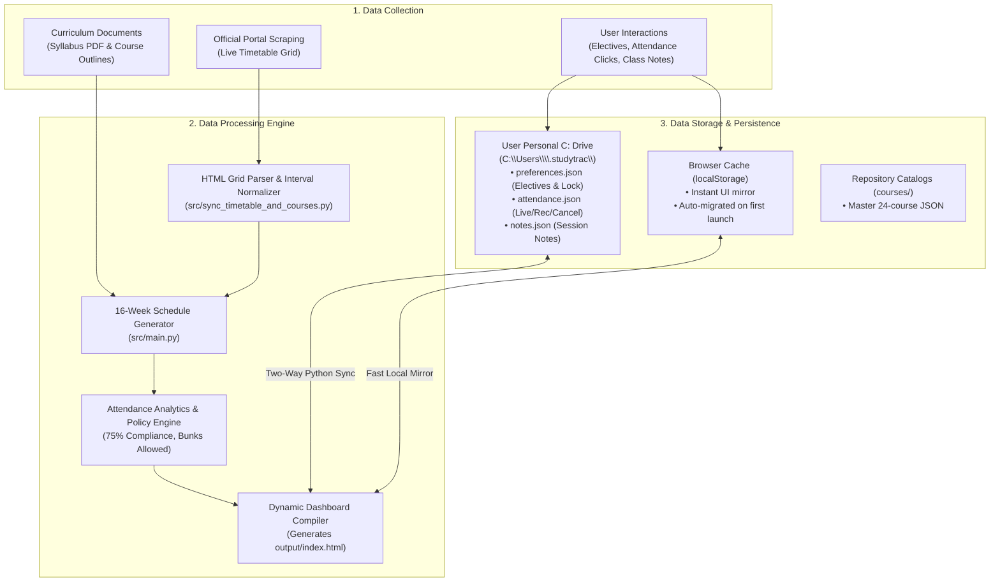

# 🎓 StudyTrac — Academic Planner & Attendance Tracker
### *Curated for IIT Patna • M.Tech in Artificial Intelligence & Data Science*

[](https://www.python.org/)
[](https://streamlit.io/)
[](https://www.iitp.ac.in/)
[](LICENSE)

**StudyTrac** is a high-performance, responsive academic management companion and curriculum planner developed specifically for students of the **M.Tech in Artificial Intelligence & Data Science** at the **Indian Institute of Technology Patna (IIT Patna)**.

---

## 🌟 Key Features

### 1. 🎓 Interactive Curriculum & Electives Selector
* **Multipage Streamlit Experience:** Switch seamlessly between the *Curriculum Selector* and *Academic Dashboard*.
* **Semesters 1 to 4 Full Catalog:** Complete syllabus, learning objectives, and textbook data for all 24 core and elective courses (84 Total Credits).
* **Elective Track Configuration:** Select approved electives (sorted by course code) while mandatory core subjects remain locked and validated.
* **Persistent Elective Saving & Defaults Reset:** Single-click `💾 Save Electives Configuration` button persists chosen electives across all app restarts (`courses/user_preferences.json`), and `🔄 Reset to Defaults` allows instant restoration to official curriculum recommendations.
* **Centered Apply Action:** Single-click curriculum generation pipeline with instant feedback.

### 2. 📅 Day-Wise Schedule & Dynamic Attendance Tracker
* **16-Week Instruction Timeline:** Date-by-date schedule spanning August 16 to November 30, 2026.
* **Direct Moodle Join Action:** Instant "Join Class" buttons in front of all class schedules redirecting directly to the official IIT Patna Moodle login portal (`https://cetpgex.iitp.ac.in/moodle/login/index.php`).
* **Dynamic Attendance Health Gauge:** Real-time computation of compliance ($\ge 75\%$ mandatory policy) with live vs. recorded lecture breakdowns, faculty cancellation tracking, and safe bunk margin counters.
* **Faculty Cancellation Support:** Ability to mark unexpected faculty cancellations as `🚫 Cancel` without penalizing attendance percentages.
* **One-Click Week Collapsing:** All 16 weeks default to collapsed view with a global `📁 Expand All / 📂 Collapse All` toggle.
* **Personal Notes per Session:** Persistent in-browser note-taking for every class slot.

### 3. 🎓 Post-Instruction Exam, Evaluation & Result Roadmap
* **Official Academic Calendar Integration:** Extracted directly from the official timetable schedule (`Classes/1sem_timetable.pdf`).
* **Emerald Green Section:** Dedicated timeline for December 2026 – January 2027:
  * **Dec 01 – Dec 30, 2026:** End Semester Examinations (ESE — 50% Weightage, Weekends Only).
  * **Jan 10, 2027:** Project Grade Submission deadline.
  * **Jan 20, 2027:** Declaration of Provisional Results.
  * **Jan 21, 2027:** Grade Revision Claim window.
  * **Jan 22, 2027:** Final Result Declaration.
  * **Jan 23, 2027:** Commencement of Spring Semester 2026–27.

### 4. 🔄 Live Portal Timetable Auto-Fetch
* **On-Demand Startup Check:** Automatically fetches the live timetable HTML from the IIT Patna portal on app startup (cached for 30 minutes).
* **Smart Interval Normalization:** Merges consecutive hourly slots (*e.g., 6–7 PM + 7–8 PM*) into single continuous sessions (*6:00 PM – 8:00 PM*).
* **Offline Resilience:** Gracefully falls back to local cache if network connectivity is unavailable.

---

## 📊 Evaluation & Grading Weightage Policy

| Component | Weightage | Description / Schedule |
|---|:---:|---|
| **Assignments & Homework** | **30%** | 4 Periodic Tasks (Sep 11–15, Sep 25–Oct 01, Oct 25–29, Nov 08–12) |
| **Quizzes & Tests** | **20%** | 2 Proctored Online Tests (Quiz 1: Oct 11–15 \| Quiz 2: Nov 22–26) |
| **End Semester Exam (ESE)** | **50%** | Proctored Online Examination (Dec 01 – Dec 30, 2026 • Weekends) |
| **Attendance Policy** | **$\ge$ 75%** | Mandatory attendance via Live sessions or LMS recorded views |

---

## 📁 Repository Structure

```plaintext
d:/IITP/
│
├── app.py                      # Root Streamlit multipage application (Navigation & UI)
├── requirements.txt            # Python dependencies (Streamlit, BeautifulSoup4, etc.)
├── README.md                   # Project documentation
│
├── src/                        # Core Python sync & generation pipelines
│   ├── main.py                 # Dashboard HTML generator & evaluation engine
│   ├── sync_timetable_and_courses.py # Live portal fetcher for timetable
│   └── generate_courses.py     # Course catalog parser
│
├── courses/                    # Course data catalogs
│   ├── all_courses.json        # 24 subjects catalog across Semesters 1 to 4
│   └── *.json                  # Individual course syllabus JSON files
│
├── Classes/                    # Reference documents & timetable assets
│   ├── 1sem_timetable.pdf      # Official Academic Calendar & Exam Timeline
│   ├── syllabus.pdf            # Complete M.Tech curriculum & syllabus document
│   └── timetable_web.html      # Local cached timetable grid from portal
│
├── output/                     # Production build artifacts
│   └── index.html              # Standalone interactive dashboard
│
└── .streamlit/
    └── config.toml             # Warm-white theme and layout configuration
```

---

## 🚀 Quickstart & Installation

### 1. Prerequisites
* **Python 3.10+**
* Virtual environment tool (`venv` or `conda`)

### 2. Setup Virtual Environment
```bash
# Clone or navigate to the project directory
cd d:/IITP

# Create and activate virtual environment (Windows PowerShell)
python -m venv virtual
.\virtual\Scripts\Activate.ps1

# Install dependencies
pip install -r requirements.txt
```

### 3. Launch the Application
```bash
# Start the Streamlit application
streamlit run app.py
```
Open **`http://localhost:8501`** in your web browser.

### 4. Direct Curriculum Generation (Optional)
To generate or re-compile the standalone `output/index.html` dashboard directly from the command line:
```bash
python src/main.py
```

---

## 🔄 Data Architecture: Collection, Storage & Processing

StudyTrac follows a privacy-first, local-native architecture designed to keep academic data synchronized, accurate, and completely under the student's control.



### 1. 📥 Data Collection
* **Live CETPG Portal Scraping:**
  * Connects directly to the official IIT Patna CETPG portal (`https://cetpgex.iitp.ac.in/`) using `urllib.request` and `BeautifulSoup4`.
  * Fetches the latest published M.Tech/MS HTML timetable grid.
  * Employs on-demand 30-minute caching with local fallback for offline resilience.
* **Curriculum Syllabus Ingestion:**
  * Official curriculum guidelines from `Classes/syllabus.pdf` are structured into master JSON schemas in `courses/` covering course codes, titles, credits, lecture schedules, learning objectives, detailed modules, and recommended textbooks.
* **Student Input Capture:**
  * **Elective Selection:** Captures user choices per semester and selection locks via the Streamlit interface.
  * **Attendance Marking:** Captures user clicks on session states (`✅ Live`, `🎥 Recorded`, `🚫 Cancel`, `⚪ Clear`).
  * **Session Notes:** Captures markdown/plain-text personal notes recorded for individual lectures.

### 2. 💾 Data Storage & Privacy
* **Local User Directory (`C:\Users\<Username>\.studytrac\`):**
  * Data is saved directly to the student's personal operating system home directory (`Path.home() / ".studytrac"`).
  * **`preferences.json`:** Stores chosen electives and configuration lock state (`locked: true`).
  * **`attendance.json`:** Stores marked attendance records (`live`, `rec`, `cancelled`, `absent`) keyed by session ID.
  * **`notes.json`:** Stores personal lecture notes.
  * **100% Private & Isolated:** Files live only on the student's physical hard drive. Neither central server hosts nor other students have access to personal attendance or notes.
  * **Browser Reset Immune:** Data survives clearing browser caches, cookies, site history, and incognito sessions.
* **Client-Side Mirror (`localStorage`):**
  * Serves as an immediate zero-latency cache in the browser for fluid UI rendering.
  * Synchronizes bidirectionally with the Python `.studytrac` storage, with automatic one-time migration for existing users.
* **Repository Catalogs (`courses/`):**
  * `courses/all_courses.json`: Master syllabus registry for all 24 courses across Semesters 1 to 4.
  * `Classes/timetable_web.html`: Cached portal timetable markup.

### 3. ⚙️ Data Processing & Analytics
* **Grid Parsing & Interval Normalization:**
  * Parses raw HTML timetable tables, maps day-of-week slots, extracts faculties, and merges consecutive 1-hour slots into single coherent class sessions (*e.g., merging 6:00–7:00 PM and 7:00–8:00 PM into a single 6:00–8:00 PM session*).
* **16-Week Schedule Generation:**
  * Generates a date-by-date calendar sequence across all 16 semester weeks (August 16 to November 30, 2026).
  * Generates unique, stable session IDs (`sess_<date>_<course>_<slot>`) for precise state association.
* **Attendance Policy & Health Calculation:**
  * **Formula:** $\text{Attendance Compliance \%} = \left(\frac{\text{Live Sessions} + \text{Recorded Sessions}}{\text{Conducted Sessions}}\right) \times 100$
  * **Excused Cancellations:** Faculty cancellations (`🚫 Cancel`) are deducted from total conducted classes so students are never penalized for classes not held.
  * **Safe Bunk Margins:** Dynamically computes remaining allowable bunks while ensuring $\ge 75\%$ compliance with IIT Patna academic regulations.
* **Dynamic Dashboard Compilation:**
  * Compiles active courses, timetable slots, evaluation roadmaps, and client sync hooks into a standalone interactive web application (`output/index.html`).

---

## 🛠️ Technology Stack
* **Frontend:** Streamlit 1.40+, HTML5, CSS3 (Warm White & High-Contrast Dark Mode), Vanilla JavaScript.
* **Backend:** Python 3.10+, BeautifulSoup4, `urllib.request`.
* **State Management & Persistence:** Local OS Storage (`~/.studytrac/`) + Browser `localStorage` + Streamlit `session_state`.
* **Deployment Compatibility:** Localhost, Streamlit Community Cloud, Docker.

---

## 👥 Department & Institution
* **Programme:** M.Tech in Artificial Intelligence and Data Science
* **Institution:** [Indian Institute of Technology Patna](https://www.iitp.ac.in/), Bihta, Patna, Bihar – 801106
* **Academic Session:** Autumn 2026 – Spring 2028

---

## ✍️ Author & Maintainer
**Crafted with ❤️ by Shivam Bhatt | IIT Patna (Batch 2026–2028)**
